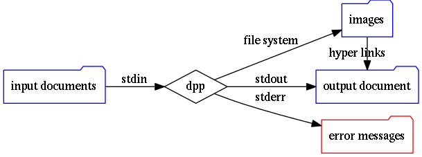
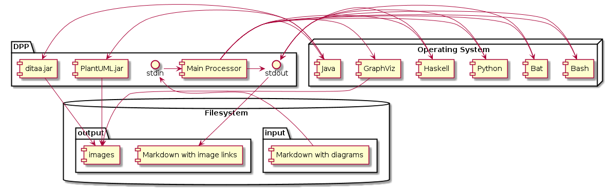
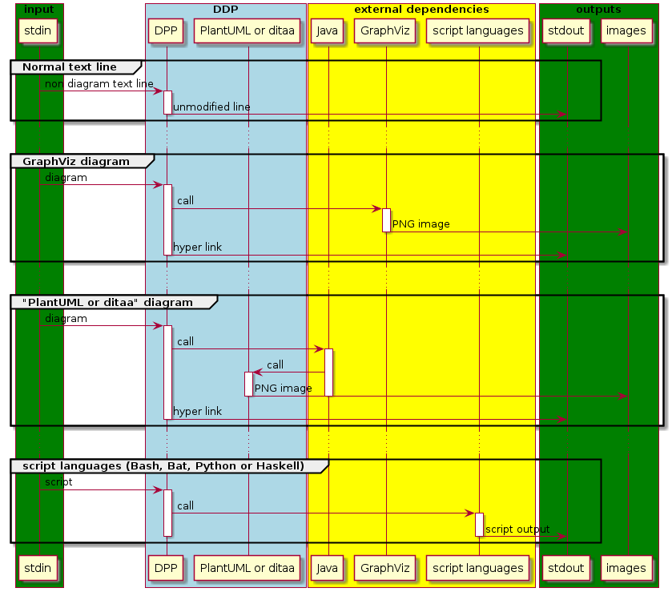
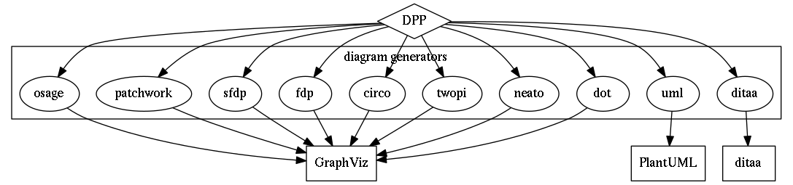
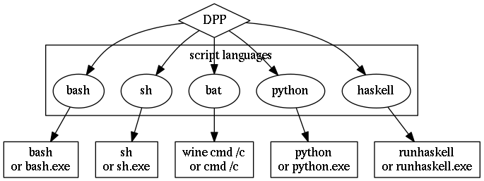
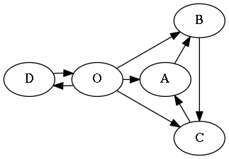
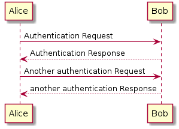

PP - Generic preprocessors (with pandoc in mind)
================================================

[PP](http://cdsoft.fr/pp "PP - Generic Preprocessor (for Pandoc)") contains three preprocessors for [Pandoc](http://pandoc.org/).

I started using Markdown and [Pandoc](http://pandoc.org/) with [GPP](http://en.nothingisreal.com/wiki/GPP). [GPP](http://en.nothingisreal.com/wiki/GPP) is still included in PP but I now use two more preprocessors that I have written for my own needs:

-   `pp` is a generic text preprocessor inspired by [GPP](http://en.nothingisreal.com/wiki/GPP) and written in Haskel
-   `dpp` is a diagram preprocessor

Both are intended to be used with Pandoc.

**News**: `dpp` capabilities are now implemented as `pp` macros. `dpp` is still included for backward compatibility. `pp` can now be used standalone.

Open source
===========

[PP](http://cdsoft.fr/pp "PP - Generic Preprocessor (for Pandoc)") is an Open source software. Any body can contribute on [GitHub](https://github.com/CDSoft/pp) to:

-   suggest or add new functionalities
-   report or fix bugs
-   improve the documentation
-   add some nicer examples
-   find new usages
-   ...

Installation
============

1.  Download and extract [pp.tgz](http://cdsoft.fr/pp/pp.tgz).
2.  Run `make dep` to install Haskell required packages.
3.  Run `make`.
4.  Copy `pp`, `dpp` and `gpp` (`.exe` files on Windows) where you want.

`pp` and `dpp` require [Graphviz](http://graphviz.org/) and Java ([PlantUML](http://plantuml.sourceforge.net/) and [ditaa](http://ditaa.sourceforge.net/) are embedded in `pp` and `dpp`).

If your are on Windows but don't have a C and Haskell compiler, you can get already compiled executables here: <http://cdsoft.fr/pp/pp-win.zip>.

You can also download 64 bit Linux binaries (built on `Linux 4.4.0-0.bpo.1-amd64 #1 SMP Debian 4.4.6-1~bpo8+1 (2016-03-20) x86_64 GNU/Linux`), they may or may not work on your specific platform: <http://cdsoft.fr/pp/pp-linux-x86_64.tgz>.

PP
==

`pp` is a simple preprocessor written in Haskell. It's mainly designed for Pandoc but may be used as a generic preprocessor. It is not intended to be as powerful as GPP for instance but is a simple implementation for my own needs, as well as an opportunity to play with Haskell.

`pp` takes strings as input and incrementally builds an environment which is a lookup table containing variables and various other information. Built-in macros are Haskell functions that takes arguments (strings) and the current environment and build a new environment in the IO monad. User defined macros are simple definitions, arguments are numbered 1 to N.

`pp` emits the preprocessed document on the standard output. Inputs are listed on the command line and concatenated, the standard input is used when no input is specified.

Command line
------------

`pp` executes arguments in the same order than the command line. It starts with an initial environment containing:

-   the environment variables of the current process
-   a `lang` variable containing the current langage (currently only French (`fr`) and English (`en`) are supported)
-   a `format` variable containing the current output format (`html` or `pdf`)

If no input file is specified, `pp` also preprocesses the standard input.

The command line arguments are intensionally very basic. The user can define and undefine variables and list input files.

**-DSYMBOL\[=VALUE\]**  
adds the symbol `SYMBOL` to the current environment and associates it to the optional value `VALUE`. If value is not given the symbol is simply defined with an empty value

**-USYMBOL**  
removes the symbol `SYMBOL` from the current environment.

Other arguments are filenames.

Files are read and preprocessed using the current state of the environment. The special file name `"-"` can be used to preprocess the standard input.

Macros
------

Built-in macros are hard coded in `pp`. User defined macros are simple text substitutions that may have any number of parameters (named `!1` to `!n`). User macros can be redefined on the command line or in the documents.

To get the value of a variable you just have to write its name after a `'!'` or `'\'`. Macros can be given arguments. Each argument is enclosed in parenthesis, curly or square brackets. For instance, the macro `foo` with two arguments can be called as `!foo(x)(y)`, `\foo{x}{y}` or even `!foo[x]{y}`.

You can choose the syntax that works better with your favorite editor and syntax colorization.

**`!def[ine](SYMBOL)[(VALUE)]`**  
Add the symbol `SYMBOL` to the current environment and associate it with the optional value `VALUE`. Arguments are denoted by `!1` ... `!n` in `VALUE`.

**`!undef[ine](SYMBOL)`**  
Remove the symbol `SYMBOL` from the current environment.

**`!ifdef(SYMBOL)(TEXT_IF_DEFINED)[(TEXT_IF_NOT_DEFINED)]`**  
if `SYMBOL` is defined in the current environnement `pp` preprocesses `TEXT_IF_DEFINED`. Otherwise it preprocesses `TEXT_IF_NOT_DEFINED`.

**`!ifndef(SYMBOL)(TEXT_IF_NOT_DEFINED)[(TEXT_IF_DEFINED)]`**  
if `SYMBOL` is not defined in the current environnement `pp` preprocesses `TEXT_IF_NOT_DEFINED`. Otherwise it preprocesses `TEXT_IF_DEFINED`.

**`!ifeq(X)(Y)(TEXT_IF_EQUAL)[(TEXT_IF_DIFFERENT)]`**  
if `X` and 'Y' are equal `pp` preprocesses `TEXT_IF_EQUAL`. Otherwise it preprocesses `TEXT_IF_DIFFERENT`. Two pieces of text are equal if all characters are the same, spaces are ignored.

**`!ifne(X)(Y)(TEXT_IF_DIFFERENT)[(TEXT_IF_EQUAL)]`**  
if `X` and 'Y' are different `pp` preprocesses `TEXT_IF_DIFFERENT`. Otherwise it preprocesses `TEXT_IF_EQUAL`.

**`!rawdef(X)`**  
get the raw (unevaluated) definition of `X`

**`!inc[lude](FILENAME)`**  
`pp` preprocesses the content of the file named `FILENAME` and includes it in the current document, using the current environment. If the file path is relative it is searched first in the directory of the current file then in the directory of the main file.

**`!raw(TEXT)`**  
`pp` emits `TEXT` without any preprocessing.

**`!rawinc[lude](FILE)`**  
`pp` emits the content of `FILE` without any preprocessing.

**`!exec(COMMAND)`**  
executes a shell command (with the current shell) and emits the output of the command.

**`!rawexec(COMMAND)`**  
as `!exec(COMMAND)` but the output is not preprocessed by `pp`.

**`!mdate(FILES)`**  
returns the modification date of the most recent file.

**`!env(VARNAME)`**  
`pp` preprocesses and emits the value of the process environment variable `VARNAME`.

**`!add(VARNAME)[(INCREMENT)]`**  
computes `VARNAME+INCREMENT` and stores the result to `VARNAME`. The default value of the increment is 1.

**`!fr(...)`** or **`!en(...)`**  
emits some text only if the current language is *fr* or *en*

**`!html(...)`** or **`!pdf(...)`**  
emits some text only if the current format is *html* or *pdf*

**`!dot(IMAGE)(LEGEND)(GRAPH DESCRIPTION)`**  
renders a diagram with [GraphViz](http://graphviz.org/), [PlantUML](http://plantuml.sourceforge.net/) and [Ditaa](http://ditaa.sourceforge.net/). See DPP for examples. The name of the macro is the kind of diagram. The possible diagrams are: `dot`, `neato`, `twopi`, `circo`, `fdp`, `sfdp`, `patchwork`, `osage`, `uml` and `ditaa`.

**`!sh(SCRIPT)`**  
executes a script and emits its output. The possible programming languages are `sh`, `bash`, `bat`, `python` and `haskell`.

DPP (as well as PP diagram examples)
====================================

Usage
-----

`dpp` is a filter and has no options. It takes some text with embedded diagrams on `stdin` and generates a text with image links on `stdout`. Some error messages may be written to `stderr`.



Being a filter, `dpp` can be chained with other preprocessors. Another good generic purpose preprocessor is `pp` or `gpp`.

`pp` now has the same diagram capabilities than `dpp`. This chapter show example for both preprocessors but `dpp` may become obsolete.

A classical usage of `dpp` along with `pp` and [Pandoc](http://pandoc.org/) is:


For instance, on any good Unix like system, you can use this command:

``` bash
$ pp documents... | dpp | pandoc -f markdown -t html5 -o document.html
```

Design
------

`dpp` was initially a preprocessor for [GraphViz](http://graphviz.org/) diagrams. It now also comes with [PlantUML](http://plantuml.sourceforge.net/), [ditaa](http://ditaa.sourceforge.net/) and scripting capabilities. `dpp` requires [GraphViz](http://graphviz.org/) and Java to be installed, [PlantUML](http://plantuml.sourceforge.net/) and [ditaa](http://ditaa.sourceforge.net/) are embedded in `dpp`.

Optionally, `dpp` can call [Bash](https://www.gnu.org/software/bash/), [Bat](https://en.wikipedia.org/wiki/Cmd.exe), [Python](https://www.python.org/) or [Haskell](https://www.haskell.org/) to execute general scripts.





Syntax
------

### Diagrams

Diagrams are written in code blocks. The first line contains:

-   the diagram generator
-   the image name (without the extension)
-   the legend (optional)

Block delimiters are made of three or more tilda or back quotes, at the beginning of the line (no space and no tab). Both lines must have the same number of tilda or back quotes.

With `dpp`:

    ~~~~~ dot path/imagename optional legend
    graph {
        "source code of the diagram"
    }
    ~~~~~

With `pp`:

    \dot(path/imagename)(optional legend)(
        graph {
            "source code of the diagram"
        }
    )

This extremely meaningful diagram is rendered as `path/imagename.png` and looks like:


The image link in the output markdown document may have to be different than the actual path in the file system. This happens when then `.md` or `.html` files are not generated in the same path than the source document. Brackets can be used to specify the part of the path that belongs to the generated image but not to the link in the output document. For instance a diagram declared as:

    ~~~~~ dot [mybuildpath/]img/diag42
    or
    \dot([mybuildpath/]img/diag42)...

will be actually generated in:

    mybuildpath/img/diag42.png

and the link in the output document will be:

    img/diag42.png

For instance, if you use Pandoc to generate HTML documents with diagrams in a different directory, there are two possibilities:

1.  the document is a self contained HTML file (option `--self-contained`), i.e. the CSS and images are stored inside the document:

-   the CSS path shall be the actual path where the CSS file is stored
-   the image path in diagrams shall be the actual path where the images are stored (otherwise Pandoc won't find them)
-   e.g.: `outputpath/img/diag42`

1.  the document is not self contained, i.e. the CSS and images are stored apart from the document:

-   the CSS path shall be relative to the output document
-   the image path in diagrams shall be relative to output document in HTML links and shall also describe the actual path where the images are stored.
-   e.g.: `[outputpath/]img/diag42`

The diagram generator can be:

-   dot
-   neato
-   twopi
-   circo
-   fdp
-   sfdp
-   patchwork
-   osage
-   uml
-   ditaa

`dpp` will not create any directory, the path where the image is written must already exist.



### Scripts

Scripts are also written in code blocks. The first line contains only the kind of script.

`dpp` syntax:

    ~~~~~ bash
    echo Hello World!
    ~~~~~

`pp` syntax:

    \bash{
    echo Hello World!    
    }

With no surprise, this script generates:

    Hello World!

The script language can be:

-   bash (or sh)
-   bat (DOS/Windows batch language)
-   python
-   haskell

`dpp` will create a temporary script before calling the associated interpretor.



### Verbatim copy

Blocks can also contain verbatim text that is preserved in the output.

    `````````` quote
    ~~~ bash
    # this bash script example won't be executed!
    # but only colorized by Pandoc.
    ~~~
    ``````````

becomes

``` bash
# this bash script example won't be executed!
# but only colorized by Pandoc.
```

Examples
--------

The [source code](pp.md) of this document contains some diagrams.

Here are some simple examples. For further details about diagrams' syntax, please read the documentation of [GraphViz](http://graphviz.org/), [PlantUML](http://plantuml.sourceforge.net/) and [ditaa](http://ditaa.sourceforge.net/).

### Graphviz

[GraphViz](http://graphviz.org/) is executed when one of these keywords is used: `dot`, `neato`, `twopi`, `circo`, `fdp`, `sfdp`, `patchwork`, `osage`

`dpp` syntax:

    ~~~~~ twopi doc/img/dpp-graphviz-example This is just a GraphViz diagram example
    digraph {
        O -> A
        O -> B
        O -> C
        O -> D
        D -> O
        A -> B
        B -> C
        C -> A
    }
    ~~~~~

`pp` syntax:

    \twopi(doc/img/dpp-graphviz-example)(This is just a GraphViz diagram example)(
    digraph {
        O -> A
        O -> B
        O -> C
        O -> D
        D -> O
        A -> B
        B -> C
        C -> A
    }
    )}

-   `twopi` is the kind of graph (possible graph types: `dot`, `neato`, `twopi`, `circo`, `fdp`, `sfdp`, `patchwork`).
-   `doc/img/dpp-graphviz-example` is the name of the image. `dpp` will generate `doc/img/dpp-graphviz-example.dot` and `doc/img/dpp-graphviz-example.png`.
-   the rest of the first line is the legend of the graph.
-   other lines are written to `doc/img/dpp-graphviz-example.dot` before running [Graphviz](http://graphviz.org/).

You can use `dpp` in a pipe before [Pandoc](http://pandoc.org/) (as well as `pp` or `gpp`) for instance:

``` bash
pp file.md | dpp | pandoc -s -S --self-contained -f markdown -t html5 -o file.html

or

cat file.md | gpp -T -x | dpp | pandoc -s -S --self-contained -f markdown -t html5 -o file.html
```

Once generated the graph looks like:



[GraphViz](http://graphviz.org/) must be installed.

### PlantUML

[PlantUML](http://plantuml.sourceforge.net/) is executed when the keyword `uml` is used. The lines `@startuml` and `@enduml` required by [PlantUML](http://plantuml.sourceforge.net/) are added by `dpp`.

`dpp` syntax:

    ~~~~~ uml doc/img/dpp-plantuml-example This is just a PlantUML diagram example
    Alice -> Bob: Authentication Request
    Bob --> Alice: Authentication Response
    Alice -> Bob: Another authentication Request
    Alice <-- Bob: another authentication Response
    ~~~~~

`pp` syntax:

    \uml(doc/img/dpp-plantuml-example)(This is just a PlantUML diagram example){
    Alice -> Bob: Authentication Request
    Bob --> Alice: Authentication Response
    Alice -> Bob: Another authentication Request
    Alice <-- Bob: another authentication Response
    }

Once generated the graph looks like:



[PlantUML](http://plantuml.sourceforge.net) is written in Java and is embedded in `dpp`. Java must be installed.

### Ditaa

[ditaa](http://ditaa.sourceforge.net/) is executed when the keyword `ditaa` is used.

`dpp` syntax:

    ~~~~~ ditaa doc/img/dpp-ditaa-example This is just a Ditaa diagram example
        +--------+   +-------+    +-------+
        |        | --+ ditaa +--> |       |
        |  Text  |   +-------+    |diagram|
        |Document|   |!magic!|    |       |
        |     {d}|   |       |    |       |
        +---+----+   +-------+    +-------+
            :                         ^
            |       Lots of work      |
            +-------------------------+
    ~~~~~

`pp` syntax:

    \ditaa(doc/img/dpp-ditaa-example)(This is just a Ditaa diagram example){
        +--------+   +-------+    +-------+
        |        | --+ ditaa +--> |       |
        |  Text  |   +-------+    |diagram|
        |Document|   |!magic!|    |       |
        |     {d}|   |       |    |       |
        +---+----+   +-------+    +-------+
            :                         ^
            |       Lots of work      |
            +-------------------------+
    }

Once generated the graph looks like:


[ditaa](http://plantuml.sourceforge.net) is written in Java and is embedded in `dpp`. Java must be installed.

### Bash

[Bash](https://www.gnu.org/software/bash/) is executed when the keyword `bash` is used.

`dpp` syntax:

    ~~~~~ bash
    echo "Hi, I'm $SHELL $BASH_VERSION"
    echo "Here are a few random numbers: $RANDOM, $RANDOM, $RANDOM"
    ~~~~~

`pp` syntax:

    \bash{
    echo "Hi, I'm $SHELL $BASH_VERSION"
    echo "Here are a few random numbers: $RANDOM, $RANDOM, $RANDOM"
    }

This script outputs:

    Hi, I'm /bin/bash 4.3.30(1)-release
    Here are a few random numbers: 10009, 2445, 5649

**Note**: the keyword `sh` executes `sh` which is generally a link to `bash`.

### Bat

[Bat](https://en.wikipedia.org/wiki/Cmd.exe) is executed when the keyword `bat` is used.

`dpp` syntax:

    ~~~~~ bat
    echo Hi, I'm %COMSPEC%
    ver
    if not "%WINELOADER%" == "" (
        echo This script is run from wine under Linux
    ) else (
        echo This script is run from a real Windows
    )
    ~~~~~

`pp` syntax:

    \bat{
    echo Hi, I'm %COMSPEC%
    ver
    if not "%WINELOADER%" == "" (
        echo This script is run from wine under Linux
    ) else (
        echo This script is run from a real Windows
    )
    }

This script outputs:

    Hi, I'm C:\windows\system32\cmd.exe

    Wine CMD version 5.1.2600 (1.6.2)
    This script is run from wine under Linux

### Python

[Python](https://www.python.org/) is executed when the keyword `python` is used.

`dpp` syntax:

    ~~~~~ python
    import sys
    import random

    if __name__ == "__main__":
        print("Hi, I'm Python %s"%sys.version)
        randoms = [random.randint(0, 1000) for i in range(3)]
        print("Here are a few random numbers: %s"%(", ".join(map(str, randoms))))
    ~~~~~

`pp` syntax:

    \python{
    import sys
    import random

    if __name__ == "__main__":
        print("Hi, I'm Python %s"%sys.version)
        randoms = [random.randint(0, 1000) for i in range(3)]
        print("Here are a few random numbers: %s"%(", ".join(map(str, randoms))))
    }

This script outputs:

    Hi, I'm Python 2.7.9 (default, Mar  1 2015, 12:57:24) 
    [GCC 4.9.2]
    Here are a few random numbers: 149, 194, 271

### Haskell

[Haskell](https://www.haskell.org/) is executed when the keyword `haskell` is used.

`dpp` syntax:

    ~~~~~ haskell
    import System.Info
    import Data.Version
    import Data.List

    primes = filterPrime [2..]
        where filterPrime (p:xs) =
                p : filterPrime [x | x <- xs, x `mod` p /= 0]

    version = showVersion compilerVersion
    main = do
        putStrLn $ "Hi, I'm Haskell " ++ version
        putStrLn $ "The first 10 prime numbers are: " ++
                    intercalate " " (map show (take 10 primes))
    ~~~~~

`pp` syntax:

    \haskell{
    import System.Info
    import Data.Version
    import Data.List

    primes = filterPrime [2..]
        where filterPrime (p:xs) =
                p : filterPrime [x | x <- xs, x `mod` p /= 0]

    version = showVersion compilerVersion
    main = do
        putStrLn $ "Hi, I'm Haskell " ++ version
        putStrLn $ "The first 10 prime numbers are: " ++
                    intercalate " " (map show (take 10 primes))
    }

This script outputs:

    Hi, I'm Haskell 7.10
    The first 10 prime numbers are: 2 3 5 7 11 13 17 19 23 29

GPP
===

[GPP](http://en.nothingisreal.com/wiki/GPP) is included in [PP](http://cdsoft.fr/pp "PP - Generic Preprocessor (for Pandoc)") because it's a must have generic text preprocessor I was using before writing `pp`.

Its documentation is here: [gpp.html](gpp.html)

Licenses
========

PP/DPP
------

Copyright (C) 2015, 2016 Christophe Delord <br> <http://www.cdsoft.fr/pp>

PP is free software: you can redistribute it and/or modify it under the terms of the GNU General Public License as published by the Free Software Foundation, either version 3 of the License, or (at your option) any later version.

PP is distributed in the hope that it will be useful, but WITHOUT ANY WARRANTY; without even the implied warranty of MERCHANTABILITY or FITNESS FOR A PARTICULAR PURPOSE. See the GNU General Public License for more details.

You should have received a copy of the GNU General Public License along with PP. If not, see <http://www.gnu.org/licenses/>.

PlantUML
--------

PlantUML.jar is integrated in \[DPP\]. [PlantUML](http://plantuml.sourceforge.net/) is distributed under the [GPL license](http://www.gnu.org/copyleft/gpl.html). See <http://plantuml.sourceforge.net/faq.html>.

ditaa
-----

ditaa.jar is integrated in \[DPP\]. [ditaa](http://ditaa.sourceforge.net/) is distributed under the [GNU General Public License version 2.0 (GPLv2)](http://sourceforge.net/directory/license:gpl/). See <http://sourceforge.net/projects/ditaa/>.

GPP
---

[GPP](http://en.nothingisreal.com/wiki/GPP) is included in the binary distribution of PP. I have just recompiled the original sources of [GPP](http://en.nothingisreal.com/wiki/GPP).

GPP was written by Denis Auroux <auroux@math.mit.edu>. Since version 2.12 it has been maintained by Tristan Miller <psychonaut@nothingisreal.com>.

Copyright (C) 1996-2001 Denis Auroux.<br> Copyright (C) 2003, 2004 Tristan Miller.

Permission is granted to anyone to make or distribute verbatim copies of this document as received, in any medium, provided that the copyright notice and this permission notice are preserved, thus giving the recipient permission to redistribute in turn.

Permission is granted to distribute modified versions of this document, or of portions of it, under the above conditions, provided also that they carry prominent notices stating who last changed them.

Feedback
========

Your feedback and contributions are welcome. You can contact me at <http://cdsoft.fr>
