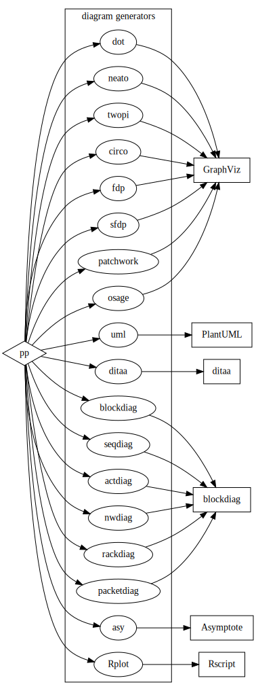
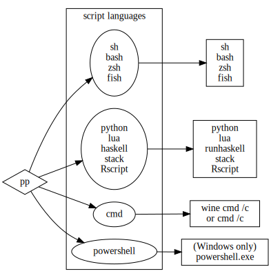
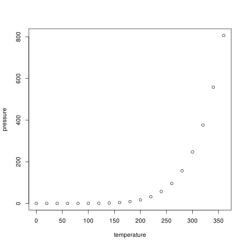

# PP - Generic preprocessor (with pandoc in mind)

[PP](https://cdsoft.fr/pp "PP - Generic Preprocessor (for Pandoc)") is a
text preprocessor designed for Pandoc (and more generally Markdown and
reStructuredText).

The [PP](https://cdsoft.fr/pp "PP - Generic Preprocessor (for Pandoc)")
package used to contain three preprocessors for
[Pandoc](http://pandoc.org/).

I started using Markdown and [Pandoc](http://pandoc.org/) with
[GPP](http://en.nothingisreal.com/wiki/GPP). Then I wrote
[DPP](https://cdsoft.fr/dpp "DPP - Diagram Preprocessor (for Pandoc)")
to embed diagrams in Markdown documents. And finally
[PP](https://cdsoft.fr/pp "PP - Generic Preprocessor (for Pandoc)")
which merges the functionalities of
[GPP](http://en.nothingisreal.com/wiki/GPP) and
[DPP](https://cdsoft.fr/dpp "DPP - Diagram Preprocessor (for Pandoc)").

[GPP](http://en.nothingisreal.com/wiki/GPP) and
[DPP](https://cdsoft.fr/dpp "DPP - Diagram Preprocessor (for Pandoc)")
are no longer included in
[PP](https://cdsoft.fr/pp "PP - Generic Preprocessor (for Pandoc)") as
`pp` can now be used standalone. `dpp` and `gpp` can be found in the
legacy
[DPP](https://cdsoft.fr/dpp "DPP - Diagram Preprocessor (for Pandoc)")
repository.

`pp` now implements:

  - macros
  - literate programming
  - [GraphViz](http://graphviz.org/),
    [PlantUML](http://plantuml.sourceforge.net/) and
    [ditaa](http://ditaa.sourceforge.net/) diagrams
  - [Asymptote](http://asymptote.sourceforge.net/) and
    [R](https://www.r-project.org/) figures
  - [Bash](https://www.gnu.org/software/bash/),
    [Cmd](https://en.wikipedia.org/wiki/Cmd.exe),
    [PowerShell](https://en.wikipedia.org/wiki/PowerShell),
    [Python](https://www.python.org/), [Lua](http://www.lua.org/),
    [Haskell](https://www.haskell.org/) and
    [R](https://www.r-project.org/) scripts
  - [Mustache](https://github.com/JustusAdam/mustache)

# Open source

[PP](https://cdsoft.fr/pp "PP - Generic Preprocessor (for Pandoc)") is
an Open source software. Anybody can contribute on
[GitHub](https://github.com/CDSoft/pp) to:

  - suggest or add new features
  - report or fix bugs
  - improve the documentation
  - add some nicer examples
  - find new usages
  - …

# Installation

**Compilation**:

1.  Download and extract [pp.tgz](https://cdsoft.fr/pp/pp.tgz).
2.  Run `make`.

[PP](https://cdsoft.fr/pp "PP - Generic Preprocessor (for Pandoc)") is
written in [Haskell](https://www.haskell.org/) and is built with
[Stack](https://docs.haskellstack.org/en/stable/README/). On MacOS,
running `make` requires the GNU version of `tar` which can be installed
with `brew install gnu-tar`.

**Installation**:

  - Run `make install` to copy `pp` in `~/.local/bin`.
  - or copy `pp` (`pp.exe` on Windows) wherever you want.

`pp` requires (*optionally*) [Graphviz](http://graphviz.org/),
[Asymptote](http://asymptote.sourceforge.net/),
[R](https://www.r-project.org/) and Java
([PlantUML](http://plantuml.sourceforge.net/) and
[ditaa](http://ditaa.sourceforge.net/) are embedded in `pp`).

**Precompiled binaries**:

The recommended way to get PP binaries is to compile them from the
sources. Anyway if you have no Haskell compiler, you can try some
precompiled binaries.

  - Latest Linux and Windows binaries:
    
      - Fedora 29 (64 bit): <https://cdsoft.fr/pp/pp-linux-x86_64.txz>
      - Windows (64 bit): <https://cdsoft.fr/pp/pp-win.7z>

  - Older version archive:
    
      - Fedora & Windows: <https://cdsoft.fr/pp/download.html>

  - User contributed Mac OS binaries (outdated):
    
      - Mac OS (64 bit binaries):
        <https://github.com/dlardi/pp/releases/download/v1.0/pp-darwin-x86_64.txz>

# Usage

`pp` is a simple preprocessor written in Haskell. It’s mainly designed
for Pandoc but may be used as a generic preprocessor. It is not intended
to be as powerful as GPP, for instance, but is a simple implementation
for my own needs, as well as an opportunity to play with Haskell.

`pp` takes strings as input and incrementally builds an environment
which is a lookup table containing variables and various other
information. Built-in macros are Haskell functions that takes arguments
(strings) and the current environment and build a new environment in the
IO monad. User defined macros are simple definitions, arguments are
numbered 1 to N.

`pp` emits the preprocessed document on the standard output. Inputs are
listed on the command line and concatenated, the standard input is used
when no input is specified.

## Command line

`pp` executes arguments in the same order as the command line. It starts
with an initial environment containing:

  - the environment variables of the current process
  - a `lang` variable containing the current langage (currently only
    French (`fr`), Italian (`it`), Spanish (`es`) and English (`en`) are
    supported)
  - a `format` variable containing the current output format (`html`,
    `pdf`, `odt`, `epub` or `mobi`)
  - a `dialect` variable containing the current dialect (`md` or `rst`)

The *dialect* is used to format links and images in the output
documents. Currently only Markdown and reStructuredText are supported.

If no input file is specified, `pp` preprocesses the standard input.

The command line arguments are intentionally very basic. The user can
define and undefine variables and list input files.

  - **`-v`**  
    displays the current version and exits.
  - **`-h`**  
    displays some help and exits.
  - **`-help`**  
    displays a longer help and exits.
  - **`-userhelp`**  
    displays a longer help for user macros only and exits.
  - **`-DSYMBOL[=VALUE]`** or **`-D SYMBOL[=VALUE]`**  
    adds the symbol `SYMBOL` to the current environment and associates
    it to the optional value `VALUE`. If no value is provided, the
    symbol is simply defined with an empty value.
  - **`-USYMBOL`** or **`-U SYMBOL`**  
    removes the symbol `SYMBOL` from the current environment.
  - **`-img=PREFIX`** or **`-img PREFIX`**  
    changes the prefix of the images output path.
  - **`-import=FILE`** or **`-import FILE`**  
    preprocessed `FILE` but discards its output. It only keeps macro
    definitions and other side effects.
  - **`-M TARGET`** or **`-M=TARGET`**  
    tracks dependencies and outputs a make rule listing the
    dependencies. The target name is necessary since it can not be
    infered by `pp`. This option only lists files that are imported,
    included and used with `mdate` and `csv`macros.
  - **`-<macro>[=<arg>]`**  
    calls a builtin macro with an optional argument (see `pp -help` for
    the full macro list). Some macros may prevent pp from reading stdin
    when no file is given on the command line (`langs`, `formats`,
    `dialects`, `os`, `arch`, `macros`, `usermacros`).

Other arguments are filenames.

Files are read and preprocessed using the current state of the
environment. The special filename “`-`” can be used to preprocess the
standard input.

## Macros

Built-in macros are hard coded in `pp` and can not be redefined. User
defined macros are simple text substitutions that may have any number of
parameters (named `!1` to `!n`). User macros can be (re)defined on the
command line or in the documents.

Macro names are:

  - case sensitive (i.e.: `!my_macro` and `!My_Macro` are different
    macros)
  - made of letters, digits and underscores (`a-zA-Z0-9_`)

User macros starting with `_` are not listed in macros lists and help
texts.

To get the value of a variable you just have to write its name after a
‘`!`’. Macros can be given arguments. Each argument is enclosed in
parenthesis, curly braces or square brackets. For instance, the macro
`foo` with two arguments can be called as `!foo(x)(y)`, `!foo{x}{y}` or
even `!foo[x][y]`. Mixing brackets, braces and parenthesis within a
single macro is not allowed: all parameters must be enclosed within the
same type of delimiters. This helps ending a list of arguments in some
edge cases:

    !macro(x)(y)
    
    [link]: foo bar
    
    Here, [link] is not parsed as a third parameter of !macro

Arguments are stripped. Removing leading and trailing spaces helps
preserving line structure in the document.

The last arguments can be enclosed between lines of tildas or backquotes
(of the same length) instead of parenthesis, brackets or braces and.
This is useful for literate programming, diagrams or scripts (see
[examples](#examples)). Code block arguments are not stripped: spaces
and blank lines are preserved.

Arguments can be on separate lines but must not be separated by blank
lines.

You can choose the syntax that works better with your favorite editor
and syntax colorization.

For most of the macros, arguments are preprocessed before executing the
macro. Macros results are not preprocessed (unless used as a parameter
of an outer macro). The `include` macro is an exception: its output is
also preprocessed. The `rawinclude` macro can include a file without
preprocessing it.

  - **`define`**, **`def`**  
    `!def[ine](SYMBOL)[[(DOC)](VALUE)]` adds the symbol `SYMBOL` to the
    current environment and associate it with the optional value
    `VALUE`. Arguments are denoted by `!1` … `!n` in `VALUE`. If `DOC`
    is given it is used to document the macro (see the `-help` option).
  - **`undefine`**, **`undef`**  
    `!undef[ine](SYMBOL)` removes the symbol `SYMBOL` from the current
    environment.
  - **`defined`**  
    `!defined(SYMBOL)` returns 1 if `SYMBOL` is defined, 0 otherwise.
  - **`rawdef`**  
    `!rawdef(X)` returns the raw (unevaluated) definition of `X`.
  - **`ifdef`**  
    `!ifdef(SYMBOL)(TEXT_IF_DEFINED)[(TEXT_IF_NOT_DEFINED)]` returns
    `TEXT_IF_DEFINED` if `SYMBOL` is defined or `TEXT_IF_NOT_DEFINED` if
    it is not defined.
  - **`ifndef`**  
    `!ifndef(SYMBOL)(TEXT_IF_NOT_DEFINED)[(TEXT_IF_DEFINED)]` returns
    `TEXT_IF_NOT_DEFINED` if `SYMBOL` is not defined or
    `TEXT_IF_DEFINED` if it is defined.
  - **`ifeq`**  
    `!ifeq(X)(Y)(TEXT_IF_EQUAL)[(TEXT_IF_DIFFERENT)]` returns
    `TEXT_IF_EQUAL` if `X` and `Y` are equal or `TEXT_IF_DIFFERENT` if
    `X` and `Y` are different. Two pieces of text are equal if all
    non-space characters are the same.
  - **`ifne`**  
    `!ifne(X)(Y)(TEXT_IF_DIFFERENT)[(TEXT_IF_EQUAL)]` returns
    `TEXT_IF_DIFFERENT` if `X` and `Y` are different or `TEXT_IF_EQUAL`
    if `X` and `Y` are equal.
  - **`if`**  
    `!if(EXPR)(TEXT_IF_EXPR_IS_TRUE)[(TEXT_IF_EXPR_IS_FALSE)]` returns
    `TEXT_IF_EXPR_IS_TRUE` if `EXPR` is true or `TEXT_IF_EXPR_IS_FALSE`
    if `EXPR` is false.
  - **`eval`**  
    `!eval(EXPR) evaluates`EXPR\`.
  - **`import`**  
    `!import(FILENAME)` works as `!include(FILENAME)` but returns
    nothing. This is useful to import macro definitions.
  - **`include`**, **`inc`**  
    `!inc[lude](FILENAME)` preprocesses and returns the content of the
    file named `FILENAME` and includes it in the current document. If
    the file path is relative it is searched first in the directory of
    the current file then in the directory of the main file.
  - **`raw`**  
    `!raw(TEXT)` returns `TEXT` without any preprocessing.
  - **`rawinclude`**, **`rawinc`**  
    `!rawinc[lude](FILE)` returns the content of `FILE` without any
    preprocessing.
  - **`comment`**  
    `!comment(TEXT)` considers `TEXT` as well as any additional
    parameters as comment. Nothing is preprocessed or returned.
  - **`quiet`**  
    `!quiet(TEXT)` quietly preprocesses `TEXT` and returns nothing. Only
    the side effects (e.g. macro definitions) are kept in the
    environment.
  - **`pp`**  
    `!pp(TEXT)` preprocesses and return `TEXT`. This macro is useful to
    preprocess the output of script macros for instance (`!sh`,
    `!python`, …).
  - **`mustache`**  
    `!mustache(JSON/YAML file)(TEMPLATE)` preprocesses `TEMPLATE` with
    mustache, using a `JSON/YAML file`.
  - **`mdate`**  
    `!mdate(FILES)` returns the modification date of the most recent
    file.
  - **`main`**  
    `!main` returns the name of the main file (given on the command
    line).
  - **`file`**  
    `!file` returns the name of the current file.
  - **`root`**  
    `!root` returns the directory name of the main file.
  - **`cwd`**  
    `!cwd` returns the directory name of the current file.
  - **`lang`**  
    `!lang` returns the current language.
  - **`langs`**  
    `!langs` lists the known languages (en, fr, it, es).
  - **`en`**  
    `!en(TEXT)` returns `TEXT` if the current language is `en`.
  - **`fr`**  
    `!fr(TEXT)` returns `TEXT` if the current language is `fr`.
  - **`it`**  
    `!it(TEXT)` returns `TEXT` if the current language is `it`.
  - **`es`**  
    `!es(TEXT)` returns `TEXT` if the current language is `es`.
  - **`format`**  
    `!format` returns the current output format.
  - **`formats`**  
    `!formats` lists the known formats (html, pdf, odf, epub, mobi).
  - **`html`**  
    `!html(TEXT)` returns `TEXT` if the current format is `html`.
  - **`pdf`**  
    `!pdf(TEXT)` returns `TEXT` if the current format is `pdf`.
  - **`odf`**  
    `!odf(TEXT)` returns `TEXT` if the current format is `odf`.
  - **`epub`**  
    `!epub(TEXT)` returns `TEXT` if the current format is `epub`.
  - **`mobi`**  
    `!mobi(TEXT)` returns `TEXT` if the current format is `mobi`.
  - **`dialect`**  
    `!dialect` returns the current output dialect.
  - **`dialects`**  
    `!dialects` lists the kown output dialects (md, rst).
  - **`md`**  
    `!md(TEXT)` returns `TEXT` if the current dialect is `md`.
  - **`rst`**  
    `!rst(TEXT)` returns `TEXT` if the current dialect is `rst`.
  - **`env`**  
    `!env(VARNAME)` preprocesses and returns the value of the process
    environment variable `VARNAME`.
  - **`os`**  
    `!os` returns the OS name (e.g. `linux` on Linux, `darwin` on MacOS,
    `windows` on Windows).
  - **`arch`**  
    `!arch` returns the machine architecture (e.g. `x86_64`, `i386`, …).
  - **`add`**  
    `!add(VARNAME)[(INCREMENT)]` computes `VARNAME+INCREMENT` and stores
    the result to `VARNAME`. The default value of the increment is 1.
  - **`append`**  
    `!append(VARNAME)[(TEXT)]` appends `TEXT` to `!VARNAME` and stores
    the result to `VARNAME`.
  - **`exec`**  
    `!exec(COMMAND)` executes a shell command with the default shell
    (`sh` or `cmd` according to the OS).
  - **`rawexec`**  
    `!rawexec` is *deprecated*. See exec.
  - **`sh`**  
    `!sh(CMD)` executes `CMD` in a `sh` shell.
  - **`bash`**  
    `!bash(CMD)` executes `CMD` in a `bash` shell.
  - **`zsh`**  
    `!zsh(CMD)` executes `CMD` in a `zsh` shell.
  - **`fish`**  
    `!fish(CMD)` executes `CMD` in a `fish` shell.
  - **`cmd`**  
    `!cmd(CMD)` executes `CMD` in a Windows shell (cmd.exe).
  - **`bat`**  
    `!bat` is *deprecated*. See cmd.
  - **`python`**  
    `!python(CMD)` executes `CMD` with the default Python interpretor.
  - **`python2`**  
    `!python2(CMD)` executes `CMD` with Python 2.
  - **`python3`**  
    `!python3(CMD)` executes `CMD` with Python 3.
  - **`lua`**  
    `!lua(CMD)` executes `CMD` with Lua.
  - **`haskell`**  
    `!haskell(CMD)` executes `CMD` as a Haskell script with
    `runhaskell`.
  - **`stack`**  
    `!stack(CMD)` executes `CMD` as a Haskell script with `stack`.
  - **`Rscript`**  
    `!Rscript(CMD)` executes `CMD` as a R script with Rscript.
  - **`powershell`**  
    `!cmd(CMD)` executes `CMD` in a Windows shell (Powershell).
  - **`dot`**  
    `!dot(IMAGE)[(LEGEND)](GRAPH DESCRIPTION)` renders a dot image with
    Graphviz.
  - **`neato`**  
    `!neato(IMAGE)[(LEGEND)](GRAPH DESCRIPTION)` renders a neato image
    with Graphviz.
  - **`twopi`**  
    `!twopi(IMAGE)[(LEGEND)](GRAPH DESCRIPTION)` renders a twopi image
    with Graphviz.
  - **`circo`**  
    `!circo(IMAGE)[(LEGEND)](GRAPH DESCRIPTION)` renders a circo image
    with Graphviz.
  - **`fdp`**  
    `!fdp(IMAGE)[(LEGEND)](GRAPH DESCRIPTION)` renders a fdp image with
    Graphviz.
  - **`sfdp`**  
    `!sfdp(IMAGE)[(LEGEND)](GRAPH DESCRIPTION)` renders a sfdp image
    with Graphviz.
  - **`patchwork`**  
    `!patchwork(IMAGE)[(LEGEND)](GRAPH DESCRIPTION)` renders a patchwork
    image with Graphviz.
  - **`osage`**  
    `!osage(IMAGE)[(LEGEND)](GRAPH DESCRIPTION)` renders a osage image
    with Graphviz.
  - **`uml`**  
    `!uml(IMAGE)[(LEGEND)](GRAPH DESCRIPTION)` renders a uml image with
    PlantUML.
  - **`ditaa`**  
    `!ditaa(IMAGE)[(LEGEND)](GRAPH DESCRIPTION)` renders a ditaa image
    with PlantUML.
  - **`asy`**  
    `!asy(IMAGE)[(LEGEND)](GRAPH DESCRIPTION)` renders a asy image with
    Asymptote.
  - **`Rplot`**  
    `!Rplot(IMAGE)[(LEGEND)](GRAPH DESCRIPTION)` renders a Rplot image
    with R.
  - **`literate`**, **`lit`**  
    `!lit[erate](FILENAME)[(LANG)][(CONTENT)]` appends `CONTENT` to the
    file `FILENAME`. If `FILENAME` starts with `@` it’s a macro, not a
    file. The output is highlighted using the programming language
    `LANGUAGE`. The list of possible languages is given by `pandoc
    --list-highlight-languages`. Files are actually written when all the
    documents have been successfully preprocessed. Macros are expanded
    when the files are written. This macro provides basic literate
    programming features. If `LANG` is not given, pp uses the previously
    defined language for the same file or macro or a default language
    according to its name. If `CONTENT`is not given, pp returns the
    current content of `FILENAME`.
  - **`flushliterate`**, **`flushlit`**  
    `!flushlit[erate]` writes files built with `!lit` before reaching
    the end of the document. This macro is automatically executed before
    any script execution or file inclusion with `!src`.
  - **`source`**, **`src`**  
    `!source(FILENAME)[(LANG)]` or `!src(FILENAME)[(LANG)]` formats an
    existing source file in a colorized code block.
  - **`codeblock`**  
    `!codeblock(LENGTH)[(CHAR)]` sets the default line separator for
    code blocks. The default value is a 70 tilda row
    (`!codeclock(70)(~)`).
  - **`indent`**  
    `!indent[(N)](BLOCK)` indents each line of a block with `N` spaces.
    The default value of `N` is 4 spaces.
  - **`csv`**  
    `!csv(FILENAME)[(HEADER)]` converts a CSV file to a Markdown or
    reStructuredText table. `HEADER` defines the header of the table,
    fields are separated by pipes (`|`). If `HEADER` is not defined, the
    first line of the file is used as the header of the table.
  - **`macrochars`**  
    `!macrochars(CHARS)` defines the chars used to call a macro. The
    default value is `"!"`. Any non space character can start a macro
    call (e.g. after `!macrochars(!\)` both `!foo` and `\foo` are valid
    macro calls.
  - **`macroargs`**  
    `!macroargs(CHARS)` defines the chars used to separate macro
    arguments. The default value is `"(){}[]"` (e.g. after
    `!macroargs(()«»)` both `!foo(...)` and `!foo«...»` are valid macro
    calls).
  - **`literatemacrochars`**  
    `!literatemacrochars(CHARS)` defines the chars used to identify
    literate programming macros. The default value is `"@"`. Any non
    space character can start a literate programming macro (e.g. after
    `!literatemacrochars(@&)` both `@foo` and `&foo` are valid macro
    calls.
  - **`macros`**  
    `!macros` lists the builtin macros.
  - **`usermacros`**  
    `!usermacros` lists the user macros.
  - **`help`**  
    `!help` prints built-in macro help.
  - **`userhelp`**  
    `!userhelp` prints user macro help.

# Expressions

The `!if` and `!eval` macros take an expression and evaluate it.
Expressions are made of:

  - integers
  - string (`"..."`)
  - integer operators (`+`, `-`, `*`, `/`)
  - boolean operators (`!`, `not`, `&&`, `and`, `||`, `or`, `xor`)
  - relational operators (`==`, `/=`, `!=`, `<`, `<=`, `>`, `>=`)
  - parentheses, brackets and braces

Boolean values are coded as integers or string (`0` and `""` are false,
other values are true).

Macros can be called in expressions. They are preprocessed before
evaluating the expression.

e.g.:

    !if( !defined(FOO) or !BAR == 42 ) (say something)

# Literate programming example

The main program just prints some messages:

    !lit(main.c)(C)
    ~~~~~~~~~~~~~~~~~~~~
    @includes
    void main()
    {
    @messages
    }
    ~~~~~~~~~~~~~~~~~~~~

First we need to be able to print messages:

    !lit(@includes)(C)
    ~~~~~~~~~~~~~~~~~~~~
    #include <stdio.h>
    ~~~~~~~~~~~~~~~~~~~~

The program must first say “Hello” :

    !lit(@messages)(C)
    ~~~~~~~~~~~~~~~~~~~~
        puts("Hello...\n");
    ~~~~~~~~~~~~~~~~~~~~

And also finally “Goodbye”:

    !lit(@messages)
    ~~~~~~~~~~~~~~~~~~~~
        puts("Goodbye.");
    ~~~~~~~~~~~~~~~~~~~~

# Diagram and script examples

## Diagrams

Diagrams are written in code blocks as argument of a diagram macro. The
first line contains the macro:

  - the diagram generator (the macro name)
  - the image name with or without the extension (first argument)
      - the default format is `svg` if no extension is provided (unless
        for ditaa diagrams which support `png` only)
      - the supported formats are `png`, `svg` and ‘pdf’ (PDF support is
        partial and may not work with PlantUML)
  - the legend (second optional argument)

Block delimiters are made of three or more tilda or back quotes, at the
beginning of the line (no space and no tab). The end delimiter must at
least as long as the beginning delimiter.

    !dot(path/imagename)(optional legend)
    ~~~~~~~~~~~~~~~~~~~~~~~~~~~~~~~~~~~~~~~~~~~
        graph {
            "source code of the diagram"
        }
    ~~~~~~~~~~~~~~~~~~~~~~~~~~~~~~~~~~~~~~~~~~~

This extremely meaningful diagram is rendered as `path/imagename.svg`
and looks like:


The image file extension can be `.svg`, `.png` or `pdf`. `SVG` is the
default format if no extension is provided (unless for ditaa diagrams).
`!dot(path/imagename.svg)(optional legend)` or
`!dot(path/imagename)(optional legend)` are rendered as
`path/imagename.svg`. `!dot(path/imagename.png)(optional legend)` is
rendered as `path/imagename.png`. `!dot(path/imagename.pdf)(optional
legend)` is rendered as `path/imagename.pdf` (if supported).

The image link in the output markdown document may have to be different
than the actual path in the file system. This happens when then `.md` or
`.html` files are not generated in the same path than the source
document. Brackets can be used to specify the part of the path that
belongs to the generated image but not to the link in the output
document. For instance a diagram declared as:

    !dot([mybuildpath/]img/diag42)...

will be actually generated in:

    mybuildpath/img/diag42.png

and the link in the output document will be:

    img/diag42.png

For instance, if you use Pandoc to generate HTML documents with diagrams
in a different directory, there are two possibilities:

1.  the document is a self contained HTML file (option
    `--self-contained`), i.e. the CSS and images are stored inside the
    document:
      - the CSS path shall be the actual path where the CSS file is
        stored
      - the image path in diagrams shall be the actual path where the
        images are stored (otherwise Pandoc won’t find them)
      - e.g.: `outputpath/img/diag42`
2.  the document is not self contained, i.e. the CSS and images are
    stored apart from the document:
      - the CSS path shall be relative to the output document
      - the image path in diagrams shall be relative to output document
        in HTML links and shall also describe the actual path where the
        images are stored.
      - e.g.: `[outputpath/]img/diag42`

Pandoc also accepts additional attributes on images (`link_attributes`
extension). These attributes can be added between curly brackets to the
first argument. e.g.:

    !dot(image.png { width=50 % })(caption)(...)

will generate the following link in the markdown output:

    { width=50 % }

The diagram generator can be:

  - dot
  - neato
  - twopi
  - circo
  - fdp
  - sfdp
  - patchwork
  - osage
  - uml
  - ditaa
  - asy
  - Rplot

`pp` will not create any directory, the path where the image is written
must already exist.



## Scripts

Scripts are also written in code blocks as arguments of a macro.

    !bash
    ~~~~~~~~~~~~~~~~~~~~~~~~~~~~~~~~~~~~~~~~~~~
    echo Hello World!
    ~~~~~~~~~~~~~~~~~~~~~~~~~~~~~~~~~~~~~~~~~~~

With no surprise, this script generates:

    Hello World!

The script language macro can be:

  - `sh`, `bash`, `zsh`, `fish` or any other shell with `sh` and a
    [shebang header](https://en.wikipedia.org/wiki/Shebang_\(Unix\))
  - `python`
  - `lua`
  - `haskell` (or `stack`)
  - `Rscript`
  - `cmd` (DOS/Windows batch language)
  - `powershell` (Windows only)

`pp` will create a temporary script before calling the associated
interpretor.



## Examples

The [source code](pp.md) of this document contains some diagrams.

Here are some simple examples. For further details about diagrams’
syntax, please read the documentation of
[GraphViz](http://graphviz.org/),
[PlantUML](http://plantuml.sourceforge.net/) and
[ditaa](http://ditaa.sourceforge.net/).

### Graphviz

[GraphViz](http://graphviz.org/) is executed when one of these keywords
is used: `dot`, `neato`, `twopi`, `circo`, `fdp`, `sfdp`, `patchwork`,
`osage`

    !twopi(doc/img/pp-graphviz-example)(This is just a GraphViz diagram example)
    ~~~~~~~~~~~~~~~~~~~~~~~~~~~~~~~~~~~~~~~~~~~
    digraph {
        O -> A
        O -> B
        O -> C
        O -> D
        D -> O
        A -> B
        B -> C
        C -> A
    }
    ~~~~~~~~~~~~~~~~~~~~~~~~~~~~~~~~~~~~~~~~~~~

  - `twopi` is the kind of graph (possible graph types: `dot`, `neato`,
    `twopi`, `circo`, `fdp`, `sfdp`, `patchwork`).
  - `doc/img/pp-graphviz-example` is the name of the image. `pp` will
    generate `doc/img/pp-graphviz-example.dot` and
    `doc/img/pp-graphviz-example.png`.
  - the rest of the first line is the legend of the graph.
  - other lines are written to `doc/img/pp-graphviz-example.dot` before
    running [Graphviz](http://graphviz.org/).
  - if the command line argument `-img=prefix`, `prefix` is added at the
    beginning of the image path.

Once generated the graph looks like:


[GraphViz](http://graphviz.org/) must be installed.

### PlantUML

[PlantUML](http://plantuml.sourceforge.net/) is executed when the
keyword `uml` is used. The lines `@startuml` and `@enduml` required by
[PlantUML](http://plantuml.sourceforge.net/) are added by `pp`.

    !uml(pp-plantuml-example)(This is just a PlantUML diagram example)
    ~~~~~~~~~~~~~~~~~~~~~~~~~~~~~~~~~~~~~~~~~~~
    Alice -> Bob: Authentication Request
    Bob --> Alice: Authentication Response
    Alice -> Bob: Another authentication Request
    Alice <-- Bob: another authentication Response
    ~~~~~~~~~~~~~~~~~~~~~~~~~~~~~~~~~~~~~~~~~~~

Once generated the graph looks like:


[PlantUML](http://plantuml.sourceforge.net) is written in Java and is
embedded in `pp`. Java must be installed.

### Ditaa

[ditaa](http://ditaa.sourceforge.net/) is executed when the keyword
`ditaa` is used.

    !ditaa(pp-ditaa-example)(This is just a Ditaa diagram example)
    ~~~~~~~~~~~~~~~~~~~~~~~~~~~~~~~~~~~~~~~~~~~
        +--------+   +-------+    +-------+
        |        | --+ ditaa +--> |       |
        |  Text  |   +-------+    |diagram|
        |Document|   |!magic!|    |       |
        |     {d}|   |       |    |       |
        +---+----+   +-------+    +-------+
            :                         ^
            |       Lots of work      |
            +-------------------------+
    ~~~~~~~~~~~~~~~~~~~~~~~~~~~~~~~~~~~~~~~~~~~

Once generated the graph looks like:


[ditaa](http://plantuml.sourceforge.net) is written in Java and is
embedded in `pp`. Java must be installed.

### Asymptote

[Asymptote](http://asymptote.sourceforge.net/) is executed when the
keyword `asy` is used.

    !asy(pp-asy-example)
        (This is just an Asymptote example from <http://asy.marris.fr/asymptote/Sciences_physiques/index.html>)
    ~~~~~~~~~~~~~~~~~~~~~~~~~~~~~~~~~~~~~~~~~~~
    import geometry;
    size(7.5cm,0);
    
    // Affichage du repère par défaut (O,vec{i},vec_{j})
    show(defaultcoordsys);
    
    real a=5, b=4, theta=-27, poids=3;
    ellipse el = ellipse(origin, a, b);
    arc     ar = arc(el,(0,-b),(a,0),CCW);
    path p = (0,-b-1)--ar--(a+1,0)--(a+1,-b-1)--cycle;
    point pO = (0,0), pM=angpoint(ar,90+theta);
    abscissa abscM = nodabscissa(el,pM);
    real     timeM = abscM.x;
    vector utangM = -dir(el,timeM), 
        unormM = rotate(90)*utangM,
        vpoids=(0,-poids),
        vreactionN = -dot(vpoids,unormM)*unormM,
        vfrottement = -dot(vpoids,utangM)*utangM;
    
    filldraw(p,lightgray,blue);
    draw(pO--pM,dashed);
    markangle("$\theta$",1.5cm,pM,origin,(1,0));
    
    // Affichage d'un nouveau repère (M,vec{u_{\theta}},vec_{u_{r}})
    coordsys R=cartesiansystem(pM,i=utangM,j=unormM);
    show("$M$", "$\vec{u_{\theta}}$", "$\vec{u_{r}}$", R, xpen=invisible);
    
    // Affichage des trois vecteurs dans le repère R
    point RpM=changecoordsys(R, pM);
    show(Label("$\vec{f}$",EndPoint),RpM+vfrottement);
    show(Label("$\vec{R}$",EndPoint),RpM+vreactionN);
    show(Label("$\vec{P}$",EndPoint),RpM+vpoids);
    ~~~~~~~~~~~~~~~~~~~~~~~~~~~~~~~~~~~~~~~~~~~

Once generated the figure looks like:


**Note**: Asymptote handles transparency in PDF format only, which is
converted to PNG by `pp`. If you need transparency, you must use the
`.png` or `pdf` format (PNG images are generated by converting the PDF
output of Asymptote). If you need scalable images, you must use the
`.svg` format, which is the default format for Asymptote diagrams.

### R (plot)

[R](https://www.r-project.org/) is executed when the keyword `Rplot` is
used.

    !Rplot(rplot-test)(This is just an R plot example)
    ~~~~~~~~~~~~~~~~~~~~~~~~~~~~~~~~~~~~~~~~~~~~~~~~~~~~~~~~~~~~~~~~~~~~~~~~
    plot(pressure)
    ~~~~~~~~~~~~~~~~~~~~~~~~~~~~~~~~~~~~~~~~~~~~~~~~~~~~~~~~~~~~~~~~~~~~~~~~

Once generated the image looks like:



### Bash

[Bash](https://www.gnu.org/software/bash/) is executed when the keyword
`bash` is used.

    !bash
    ~~~~~~~~~~~~~~~~~~~~~~~~~~~~~~~~~~~~~~~~~~~
    echo "Hi, I'm $SHELL $BASH_VERSION"
    RANDOM=42 # seed
    echo "Here are a few random numbers: $RANDOM, $RANDOM, $RANDOM"
    ~~~~~~~~~~~~~~~~~~~~~~~~~~~~~~~~~~~~~~~~~~~

This script outputs:

    Hi, I'm bash 4.4.23(1)-release
    Here are a few random numbers: 17766, 11151, 23481

**Note**: the keyword `sh` executes `sh` which is generally a link to
`bash`.

### Cmd

Windows’ [command-line
interpreter](https://en.wikipedia.org/wiki/Cmd.exe) is executed when the
keyword `cmd` is used.

    !cmd
    ~~~~~~~~~~~~~~~~~~~~~~~~~~~~~~~~~~~~~~~~~~~
    echo Hi, I'm %COMSPEC%
    ver
    if "%WINELOADER%%WINELOADERNOEXEC%%WINEDEBUG%" == "" (
        echo This script is run from wine under Linux
    ) else (
        echo This script is run from a real Windows
    )
    ~~~~~~~~~~~~~~~~~~~~~~~~~~~~~~~~~~~~~~~~~~~

This script outputs:

    Hi, I'm C:\windows\system32\cmd.exe
    
    Microsoft Windows 10.0.17134 (4.5)
    This script is run from wine under Linux

### Python

[Python](https://www.python.org/) is executed when the keyword `python`
is used.

    !python
    ~~~~~~~~~~~~~~~~~~~~~~~~~~~~~~~~~~~~~~~~~~~
    import sys
    import random
    
    if __name__ == "__main__":
        print("Hi, I'm Python %s"%sys.version)
        random.seed(42)
        randoms = [random.randint(0, 1000) for i in range(3)]
        print("Here are a few random numbers: %s"%(", ".join(map(str, randoms))))
    ~~~~~~~~~~~~~~~~~~~~~~~~~~~~~~~~~~~~~~~~~~~

This script outputs:

    Hi, I'm Python 2.7.15 (default, Oct 15 2018, 15:26:09) 
    [GCC 8.2.1 20180801 (Red Hat 8.2.1-2)]
    Here are a few random numbers: 640, 25, 275

### Lua

[Lua](http://www.lua.org/) is executed when the keyword `lua` is used.

    !lua
    ~~~~~
    print("Hi, I'm ".._VERSION)
    math.randomseed(42)
    t = {}
    for i = 1, 3 do table.insert(t, math.random(0, 999)) end
    print("Here are a few random numbers: "..table.concat(t, ", "))
    ~~~~~

This script outputs:

    Hi, I'm Lua 5.3
    Here are a few random numbers: 329, 690, 422

### Haskell

[Haskell](https://www.haskell.org/) is executed when the keyword
`haskell` is used.

    !haskell
    ~~~~~~~~~~~~~~~~~~~~~~~~~~~~~~~~~~~~~~~~~~~
    import System.Info
    import Data.Version
    import Data.List
    
    primes = filterPrime [2..]
        where filterPrime (p:xs) =
                p : filterPrime [x | x <- xs, x `mod` p /= 0]
    
    version = showVersion compilerVersion
    
    main = do
        putStrLn $ "Hi, I'm Haskell " ++ version
        putStrLn $ "The first 10 prime numbers are: " ++
                    intercalate " " (map show (take 10 primes))
    ~~~~~~~~~~~~~~~~~~~~~~~~~~~~~~~~~~~~~~~~~~~

This script outputs:

    Hi, I'm Haskell 8.6
    The first 10 prime numbers are: 2 3 5 7 11 13 17 19 23 29

### Stack

[Haskell](https://www.haskell.org/) is also executed when the keyword
`stack` is used. In this case stack meta data must be added at the
beginning of the script.

    !stack
    ~~~~~~~~~~~~~~~~~~~~~~~~~~~~~~~~~~~~~~~~~~~
    {- stack script --resolver lts-13.1 --package base -}
    
    import System.Info
    import Data.Version
    import Data.List
    
    primes = filterPrime [2..]
        where filterPrime (p:xs) =
                p : filterPrime [x | x <- xs, x `mod` p /= 0]
    
    version = showVersion compilerVersion
    
    main = do
        putStrLn $ "Hi, I'm Haskell " ++ version
        putStrLn $ "The first 10 prime numbers are: " ++
                    intercalate " " (map show (take 10 primes))
    ~~~~~~~~~~~~~~~~~~~~~~~~~~~~~~~~~~~~~~~~~~~

This script outputs:

    Hi, I'm Haskell 8.6
    The first 10 prime numbers are: 2 3 5 7 11 13 17 19 23 29

### R (script)

[R](https://www.r-project.org/) is executed when the keyword `Rscript`
is used.

    !Rscript
    ~~~~~
    model = lm(dist~speed, data = cars)
    summary(model)
    ~~~~~

This script outputs:

``` 

Call:
lm(formula = dist ~ speed, data = cars)

Residuals:
    Min      1Q  Median      3Q     Max 
-29.069  -9.525  -2.272   9.215  43.201 

Coefficients:
            Estimate Std. Error t value Pr(>|t|)    
(Intercept) -17.5791     6.7584  -2.601   0.0123 *  
speed         3.9324     0.4155   9.464 1.49e-12 ***
---
Signif. codes:  0 ‘***’ 0.001 ‘**’ 0.01 ‘*’ 0.05 ‘.’ 0.1 ‘ ’ 1

Residual standard error: 15.38 on 48 degrees of freedom
Multiple R-squared:  0.6511,    Adjusted R-squared:  0.6438 
F-statistic: 89.57 on 1 and 48 DF,  p-value: 1.49e-12
```

# Mustache templates

`pp` uses a builtin Haskell
[Mustache](https://github.com/JustusAdam/mustache) implementation that
reads JSON or YAML files and generates text from a Mustache template.

[Mustache](https://github.com/JustusAdam/mustache) is executed when the
keyword `mustache` is used.

    !mustache(../package.yaml)
    ```````````````````````````````````````
    This is the documentation for `{{name}}` version {{version}} by {{author}}.
    Copyright !bold({{copyright}}).
    ```````````````````````````````````````

`package.yaml` contains:

    name:                pp
    version:             2.7.3
    github:              "CDSoft/pp"
    license:             GPL-3
    author:              "Christophe Delord"
    maintainer:          "cdsoft.fr"
    copyright:           "2015-2019 Christophe Delord"

Lambdas are not supported but the template is preprocessed by `pp`
before calling Mustache. E.g. `!bold` can be defined as
`!def(bold)(**!1**)`. These “*lambda macros*” can be defined in the
YAML/JSON data file as well, which is a non standard way to define
Mustache lambdas that works with `pp` only.

This
    outputs:

    This is the documentation for `pp` version 2.7.3 by Christophe Delord.
    Copyright **2015-2019 Christophe Delord**.

# CSV tables

CSV files can be included in documents and rendered as Markdown or
reStructuredText tables. The field separator is inferred from the
content of the file. It can be a comma, a semicolon, tabulation or a
pipe.

## Files with a header line

This file:

    Year,Make,Model,Description,Price
    1997,Ford,E350,"ac, abs, moon",3000.00
    1999,Chevy,"Venture ""Extended Edition""","",4900.00
    1999,Chevy,"Venture ""Extended Edition, Very Large""",,5000.00
    1996,Jeep,Grand Cherokee,"MUST SELL!
    air, moon roof, loaded",4799.00

is rendered by `!csv(file.csv)`
as:

| Year | Make  | Model                                  | Description                        |   Price |
| ---: | :---- | :------------------------------------- | :--------------------------------- | ------: |
| 1997 | Ford  | E350                                   | ac, abs, moon                      | 3000.00 |
| 1999 | Chevy | Venture “Extended Edition”             |                                    | 4900.00 |
| 1999 | Chevy | Venture “Extended Edition, Very Large” |                                    | 5000.00 |
| 1996 | Jeep  | Grand Cherokee                         | MUST SELL\! air, moon roof, loaded | 4799.00 |

## Files without any header line

This file:

    1997,Ford,E350,"ac, abs, moon",3000.00
    1999,Chevy,"Venture ""Extended Edition""","",4900.00
    1999,Chevy,"Venture ""Extended Edition, Very Large""",,5000.00
    1996,Jeep,Grand Cherokee,"MUST SELL!
    air, moon roof, loaded",4799.00

is rendered by `!csv(file.csv)(Year|Make|Model|Description|Price)`
as:

| Year | Make  | Model                                  | Description                        |   Price |
| ---: | :---- | :------------------------------------- | :--------------------------------- | ------: |
| 1997 | Ford  | E350                                   | ac, abs, moon                      | 3000.00 |
| 1999 | Chevy | Venture “Extended Edition”             |                                    | 4900.00 |
| 1999 | Chevy | Venture “Extended Edition, Very Large” |                                    | 5000.00 |
| 1996 | Jeep  | Grand Cherokee                         | MUST SELL\! air, moon roof, loaded | 4799.00 |

# OS support

PP is meant to be portable and multi platform. To be OS agnostic, the
use of free script languages is strongly recommended. For instance, bash
scripts are preferred to proprietary closed languages because they can
run on any platform. It is standard on Linux and pretty well supported
on Windows (Cygwin, MSYS/Mingw, Git Bash, BusyBox, …). Python is also a
good choice.

Anyway, if some documents require portability and specific tools, PP
provides some macros to detect the OS (`!os`, `!arch`). E.g.:

    !quiet
    ~~~~~~~~~~~~~~~~~~~~~~~~~~~~~~~~~~~~~~~~~~~~~~~
    !ifeq(!os)(linux)
    `````````````````````
    !def(linux)(!1)
    !def(win)()
    `````````````````````
    !ifeq(!os)(windows)
    `````````````````````
    !def(linux)()
    !def(win)(!1)
    `````````````````````
    ~~~~~~~~~~~~~~~~~~~~~~~~~~~~~~~~~~~~~~~~~~~~~~~
    
    !win(Sorry, you're running Windows)
    !linux(Hello, happy GNU/Linux user)

The `!exec` macro is also OS aware. It runs the *default* shell
according to the OS (`sh` on Linux and MacOS, `cmd` on Windows).

# Third-party documentations, tutorials and macros

  - [PP
    tutorial](https://github.com/tajmone/markdown-guide/tree/master/pp)
    by [tajmone](https://github.com/tajmone): a good starting point for
    beginners.
  - [Pandoc-Goodies PP-Macros
    Library](https://github.com/tajmone/pandoc-goodies/tree/master/pp)
    by [tajmone](https://github.com/tajmone): an ongoing collaborative
    effort to build a library of PP macros.

# Licenses

## PP

Copyright (C) 2015-2019 Christophe Delord <br>
<https://www.cdsoft.fr/pp>

PP is free software: you can redistribute it and/or modify it under the
terms of the GNU General Public License as published by the Free
Software Foundation, either version 3 of the License, or (at your
option) any later version.

PP is distributed in the hope that it will be useful, but WITHOUT ANY
WARRANTY; without even the implied warranty of MERCHANTABILITY or
FITNESS FOR A PARTICULAR PURPOSE. See the GNU General Public License for
more details.

You should have received a copy of the GNU General Public License along
with PP. If not, see <http://www.gnu.org/licenses/>.

## PlantUML

PlantUML.jar is integrated in
[PP](https://cdsoft.fr/pp "PP - Generic Preprocessor (for Pandoc)").
[PlantUML](http://plantuml.sourceforge.net/) is distributed under the
[GPL license](http://www.gnu.org/copyleft/gpl.html). See
<http://plantuml.sourceforge.net/faq.html>.

## ditaa

ditaa.jar is not integrated anymore in
[PP](https://cdsoft.fr/pp "PP - Generic Preprocessor (for Pandoc)"). The
[ditaa](http://ditaa.sourceforge.net/) version used is the one already
integrated in [PlantUML](http://plantuml.sourceforge.net/).
[ditaa](http://ditaa.sourceforge.net/) is distributed under the [GNU
General Public License version 2.0
(GPLv2)](http://sourceforge.net/directory/license:gpl/). See
<http://sourceforge.net/projects/ditaa/>.

# Feedback

Your feedback and contributions are welcome. You can contact me at
<https://cdsoft.fr>
